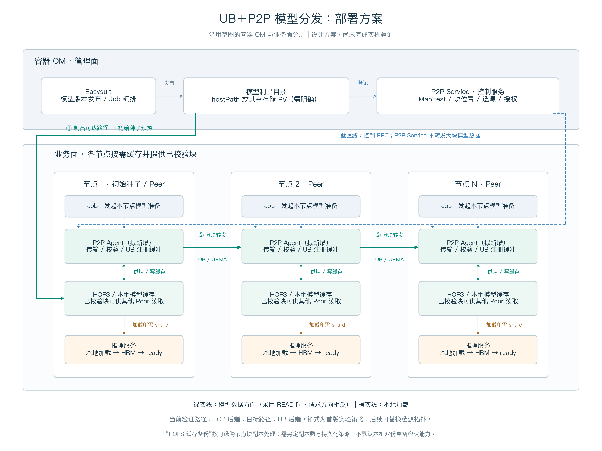

# 草图到当前方案的映射

设计提案，尚未实现；组件职责是本次方案约定，不是对现有产品功能的确认。

|草图组件|方案中的职责|待确认项|
|---|---|---|
|容器 OM / Easysuit|模型版本发布、模型准备 Job 编排|实际编排接口；图中省略编排到 Job 的连线|
|hostPath / 共享 PV|保存权威模型制品，提供初始种子读取路径|二者不能默认等价；如果目录只在 OM 本机可见，需要导出/供数服务或先传至种子，不能直接当跨节点共享卷|
|P2P Service|Manifest、块位置、选源、授权等控制服务|是本方案建议的控制职责，是否复用已有服务需评估；目录登记由发布流程触发，非存储自行发 RPC|
|Job|要求本节点准备指定版本和 shard，等待数据就绪|Job 与节点常驻 Agent 的调用接口；Job 不承担持续供数|
|P2P Agent（新增）|接收/供块、校验、缓存适配、TCP/URMA 传输|优先作为节点常驻组件；UB 注册缓冲不等于 HOFS 已原生支持 UB|
|HOFS 缓存|保存已校验块，供本地加载与 Peer 转发|HOFS 实际部署位置、读写接口、是否自身已有跨节点机制均待确认|
|HOFS 缓存备份|暂映射为可选的跨节点块副本策略|原草图是否指同机备份、另一卷或独立备份服务尚不明确；本图不把它当已实现的容灾副本|
|推理服务|从本地缓存加载所需 shard，进入 HBM 并 warmup|分发完成和服务 ready 分别测量|

## 数据路径与边界

1. 权威制品先通过已确认的访问路径预热节点 1；该路径未预设为 UB。源端供数、校验和预热耗时单独计量。
2. 接收节点定位候选 Peer、获取读授权，由 Agent 拉取分块。图中绿色箭头是字节方向；采用 URMA READ 时，请求方向相反。
3. 校验完成的块才进入可供数目录；Peer 不必等待整个模型收完才供出已校验块。缓存与注册缓冲之间可能有复制，零拷贝不是既定能力。
4. 当前计划先实现 TCP baseline，再替换 UB 数据后端；少量控制 RPC 可继续走 TCP。图中链式转发对应首版实验，不排除后续多源/拓扑感知选源。
5. 本图 N 个业务节点包括预热节点 1；历史仿真的 N 个空客户端不含额外种子。若要严格对应历史对照，应另设种子，或在公式中使用 N−1 个空接收节点。

业务节点能否同时担任种子还需验证 CPU、内存、磁盘与推理负载竞争。一个权威版本可以有多个缓存副本；备份、持久化和副本数应分别定义。

可编辑矢量图：[deployment_proposal.svg](figures/deployment_proposal.svg)；生成代码：[draw_deployment.py](draw_deployment.py)。
