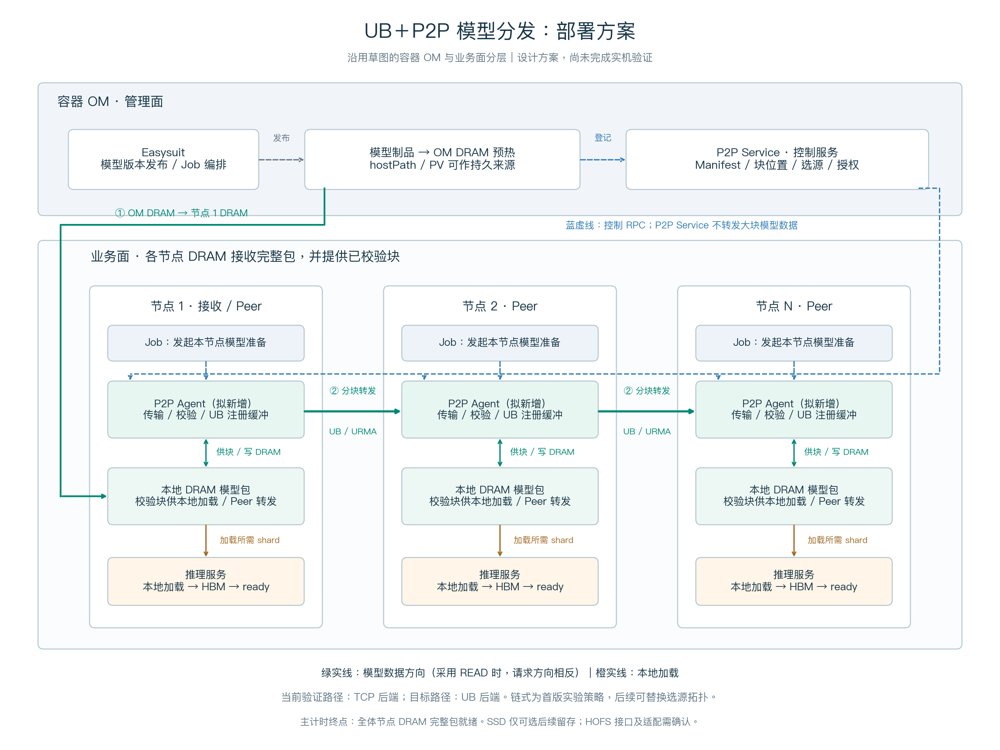

# 草图到当前方案的映射

设计提案，尚未实现；组件职责是本次方案约定，不是对现有产品功能的确认。2026-09-28 修正：分发目标为每个接收节点的本地 DRAM 完整包就绪，SSD 仅可选后续留存。

|草图组件|方案中的职责|待确认项|
|---|---|---|
|容器 OM / Easysuit|模型版本发布、模型准备 Job 编排|实际编排接口；图中省略编排到 Job 的连线|
|hostPath / 共享 PV|保存权威模型制品，提供初始种子读取路径|二者不能默认等价；如果目录只在 OM 本机可见，需要导出/供数服务或先传至种子，不能直接当跨节点共享卷|
|P2P Service|Manifest、块位置、选源、授权等控制服务|是本方案建议的控制职责，是否复用已有服务需评估；目录登记由发布流程触发，非存储自行发 RPC|
|Job|要求本节点准备指定版本和 shard，等待数据就绪|Job 与节点常驻 Agent 的调用接口；Job 不承担持续供数|
|P2P Agent（新增）|接收/供块、校验、缓存适配、TCP/URMA 传输|优先作为节点常驻组件；UB 注册缓冲不等于 HOFS 已原生支持 UB|
|HOFS 缓存|按当前方案适配本地 DRAM 块目录，供加载与 Peer 转发；图中明确物理数据在 DRAM|HOFS 实际部署位置、读写接口、是否自身已有跨节点机制均待确认|
|HOFS 缓存备份|暂映射为可选的跨节点块副本策略|原草图是否指同机备份、另一卷或独立备份服务尚不明确；本图不把它当已实现的容灾副本|
|推理服务|从本地缓存加载所需 shard，进入 HBM 并 warmup|分发完成和服务 ready 分别测量|

## 数据路径与边界

1. 权威制品预热到 OM DRAM；OM 与业务节点同构。预热准备单列；主计时从 OM 向最初无副本的 N 个业务节点分发开始，节点 1 收到块后即可参与转发。
2. 接收节点定位候选 Peer、获取读授权，由 Agent 拉取分块。图中绿色箭头是字节方向；采用 URMA READ 时，请求方向相反。
3. 校验完成的块才进入可供数目录；Peer 不必等待整个模型收完才供出已校验块。缓存与注册缓冲之间可能有复制，零拷贝不是既定能力。
4. 当前计划先实现 TCP baseline，再替换 UB 数据后端；少量控制 RPC 可继续走 TCP。图中链式转发对应首版实验，不排除后续多源/拓扑感知选源。
5. 本图 N 个业务节点均为接收者，OM 额外作为初始源，与当前同构仿真 N 的口径一致。N=50 表示 50 个接收节点；若整个集群含 OM 共 50 台，则 N=49。
6. 主计时止于全体节点 DRAM 完整包就绪；SSD 后续留存与模型加载/服务 ready 单列，不等待 SSD 才确认模型包就绪。

业务节点同时担任 Peer 需验证 CPU、DRAM 收发和在线推理负载竞争；每个节点须预留完整包容量。一个权威版本可以有多个缓存副本；备份、持久化和副本数应分别定义。

可编辑矢量图：[deployment_proposal.svg](figures/deployment_proposal.svg)；生成代码：[draw_deployment.py](draw_deployment.py)。
