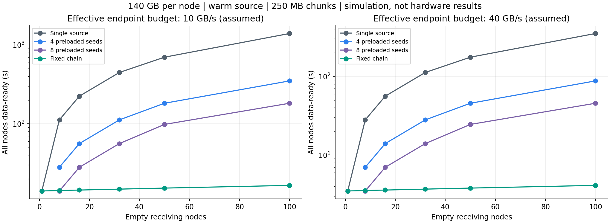
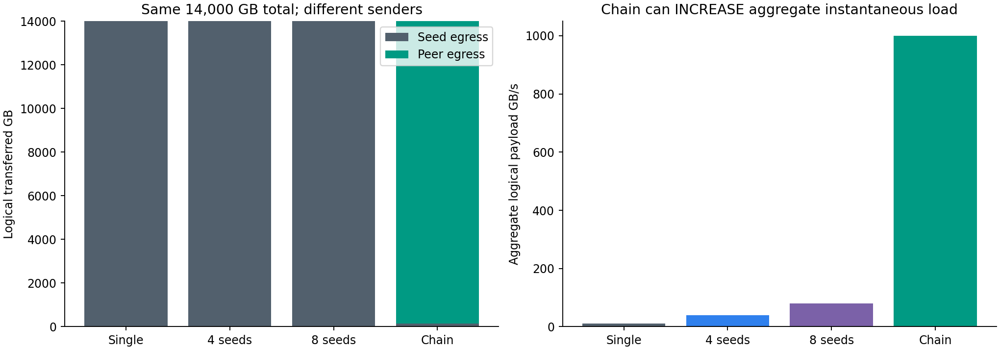
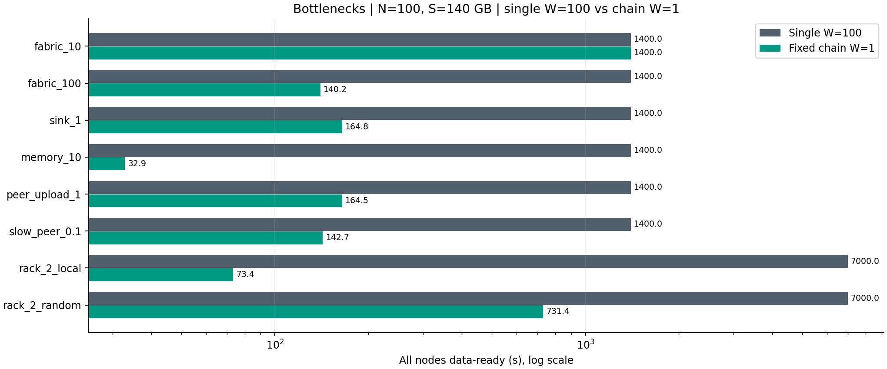
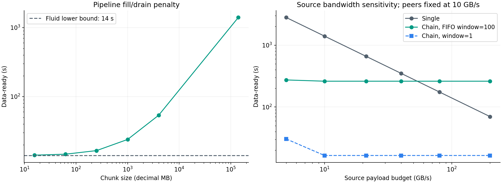

# 实验附录：模型、参数与历史结果

**复核版｜122 条历史运行记录、113 个不同配置；不包含 TCP/UB 实机或协议仿真。**

表中 W 是每发送端的活跃块窗口，不同窗口比较不可解释为纯策略因果效果。原始记录中的 policy=p2p 是代码名称；下文仍保留这一名称以方便索引。

本附录保存公式、参数和结果细节，方案结论以 [主报告](report.md) 为准。P2P 在本附录专指已实现的固定链式流水转发（仅一个场景采用轮转起点），不代表任意 swarm。

## A. 数学模型、单位与下界

### A.1 单位

统一使用十进制：1 GB=10⁹ byte；1 GB/s=8 Gbit/s。代码字段 `*_gbps` **均表示 GB/s，不是 Gbit/s**，这是容易误读的命名，读取配置时以本说明为准。MiB 需乘 2²⁰ 转为 byte，不能直接当 MB。

S 表示每个客户端需要接收的模型字节量。140 GB 约等于 70×10⁹ 参数×2 byte 的纯权重，不包括量化元数据、文件封装、镜像、KV cache 和运行时临时内存。这里的“节点”是一个接收与供数实体，可以由一台多 NPU 服务器实现，不代表单张 NPU 必须容纳 140 GB。

### A.2 集中单源与多种子

```text
T_single ≥ max(N×S / Bs, S / d_min, N×S / F)
T_kseed  ≥ max(N×S / ΣBs_j, S / d_min, N×S / F)
```

Bs 是种子持续可供出的有效载荷带宽，d_min 是最慢客户端的接收能力，F 是对每次逻辑传输计一次的共享容量预算。它不是营销意义上的双向交换总带宽。如果源数据不在内存，Bs 还受实际供数路径限制。

本仿真多种子静态把客户端按 i mod k 分配到种子。节点数不能整除 k 时，在其他资源不限制的条件下，更贴近结果的是：

```text
T_kseed ≈ ceil(N/k) × S / Bs_per_seed + L
```

例如 100 客户端、8 种子、每种子 10 GB/s 时，最忙种子服务 13 个客户端，得到 182 秒，而不是理想均分下界 175 秒。若按块跨种子调度可改善，但本次未实现。

### A.3 一份初始种子的 P2P 理想下界

```text
T_p2p ≥ max(S / Bs, S / d_min, N×S / (Bs+Σu_i), N×S / F)
```

u_i 是客户端愿意贡献的上传能力。这个下界忽略数据尚未扩散时的因果约束，不能当作可达时间。没有硬件多播、压缩或初始客户端缓存时，总逻辑传输量仍为 N×S；本报告策略使种子发 S、Peer 合计发 (N−1)×S。

### A.4 额外割集和内存约束

对本策略的任一资源 r，所有占用它的传输量为 V_r，容量为 C_r，则 T≥V_r/C_r。机架出/入方向分别约束；一次跨机架传输在总逻辑流量只计一次，在源机架出口和目标机架入口各占一次预算。

客户端 DDR 采用一个收发共享的有效预算：upload_i + download_i ≤ M_i。内部复制、校验与协议额外访存未逐次建模；需要用实测把物理 DDR 带宽转换为可用的载荷预算。不能把芯片峰值内存带宽直接代入。

### A.5 流水线策略的可校验闭式解

在相同每跳有效速率 B、固定链条、每发送端一个活跃块、无其他瓶颈，且 S=M×c 可整除时：

```text
T_pipeline = (M + N − 1) × c / B + N × L
           = S/B + (N−1)×c/B + N×L
```

L 是块发送完毕到接收方可发布/转发的延迟。它可并行，不是串行 CPU 校验服务时间。该公式适用于本实现的事件语义，并已用自动化测试对照；不适用于任意拥塞或任意 P2P 调度器。

当 N=100、S=140 GB、c=0.25 GB、B=10 GB/s、L=20 μs：T=14+2.475+0.002=16.477 秒。减小 c 可以降低填充/排空时间，但本模型没有 per-chunk CPU 开销，不能用它确定真实最优分块尺寸。

## B. 仿真实现及全部默认规格

### B.1 仿真层次

代码是**流体带宽约束＋分块因果依赖的离散事件模拟器**。没有建立真实连接，没有传输 14 TB 文件，也没有运行推理。它模拟的是多少 GB 数据在什么资源限制下何时完成。

每次事件为一次传输完成或某块可发布。活跃流通过 progressive filling 得到最大最小公平速率：同时受上传、下载、DDR、全局共享预算、源机架出口和目标机架入口限制。每次分配都断言没有越过资源容量。正在传输的块不可提前转发，也不可被第二次送到同一接收节点。

### B.2 策略

- **single**：一个额外种子，按“块优先、客户端轮转”队列供数。
- **multi**：4/8 个额外且独立供数的预热种子；每客户端绑定一个种子。所有种子放在源机架 0；启用机架限制时，它们共享该机架出口。
- **p2p / fixed**：种子向路径首节点注入全部分块；每块沿包含所有客户端的同一条链依次转发。数据面为节点到节点，控制面可以集中。主实验不需要全去中心化发现协议。
- **p2p / rotating**：对照策略，不同块从不同客户端起步，再沿环绕路径访问每个客户端一次；只执行一个粗粒度策略对照，不宣称最优。

固定链条是易复现的构造性例子，不是生产级 swarm。慢 Peer 可能拖慢大量后继节点；没有失效重试、动态父节点重选和多树容错。

### B.3 默认参数

|参数|默认值|性质|
|---|---:|---|
|客户端 N|100；规模扫描 1/8/16/32/50/100|独立空接收节点，种子另计|
|每客户端 S|140 GB|全模型需求假设|
|分块 c|0.25 GB=250 MB|宏观调度块，不是 UB 报文大小|
|种子出口 Bs|10 GB/s|有效载荷假设|
|客户端接收 d|10 GB/s|有效载荷假设|
|客户端上传 u|10 GB/s|可与下载同时进行的假设|
|每发送端活跃块 W|1|其余进入 FIFO 队列；另扫 4/16/100|
|每块发布延迟 L|20 μs|统一抽象假设，不是 UB 实测时延|
|接收端 sink|不构成瓶颈；代码 10⁹ GB/s 哨兵值|主实验收内存；另扫 1 GB/s|
|DDR 共享载荷预算|不构成瓶颈；另扫 10 GB/s|同一 Peer 收发共同占用|
|全局共享容量 F|不构成瓶颈；另扫 10/100/400 GB/s|不是具体交换机型号|
|机架|每 10 客户端一架；种子在额外源架|N=100 时共 11 个抽象机架|
|机架方向容量|不构成瓶颈；另扫 2 GB/s|同架流量不计入该出口|
|慢节点|默认无；对照节点 0 收发降至 10%|没有故障恢复|
|初始缓存|仅种子有完整热模型；客户端全空|源冷读单独做解析估算|
|缓存回收、竞争业务、校验吞吐|未模拟|必须在实机阶段补充|

随机因素仅用于客户端路径排列；随机种子固定写入结果。没有将随机排序重复解释为真实系统的性能置信区间。所有场景完整参数在 results.json/results.csv，复现实验不依赖报告中的省略项。

## C. 已运行的实验结果

### C.1 50～100 节点，单源、多种子、P2P

{{SCALE_TABLE}}

时间终点为全部客户端“块接收完成并发布可用”，不含模型加载和服务 ready。除带宽参数外使用默认规格。源端和客户端带宽同时从 10 增加到 40 GB/s，大体使网络阶段缩短为 1/4；这是容量参数的结果，不是仿真独立证明 UB 协议有额外 4 倍收益。



### C.2 流量和缓存没有消失

{{TRAFFIC_TABLE}}

100 节点主实验中，源端字节从 14,000 GB 降到 140 GB，减少 99%（由每块只注入一次的路线构造决定，并非独立性能发现）；但全网总逻辑字节都为 14,000 GB。源端峰值在两种策略下仍能达到 10 GB/s，因此“源端总字节减少”也不等于“源端瞬时峰值降低”。P2P 用更多节点同时上传，可能把全局瞬时载荷从 10 GB/s 推高至约 1,000 GB/s。

这正是需要机架感知、全局限速和后台业务预算的原因。不能将“解决源端热点”写成“整个网络带宽不再暴涨”。图中的总流量按逻辑传输计一次，没有包含多级交换逐跳 byte-hop、TCP/UB 头、ACK 或重传。



### C.3 瓶颈、拓扑与反例

{{LIMITS_TABLE}}

解释：

- F=10 GB/s 时，所有策略都受 14,000/10=1,400 秒的共享资源约束。源端卸载不能创造网络容量。
- sink=1 GB/s 表示每客户端的持续接收/消费管线预算，不是细化的 SSD 写放大或 fsync 模型；未证明实际 NVMe 可以按表中速率读写并行。
- DDR=10 GB/s 时，中继同时读和写，容易受共享内存预算限制。Peer 上传降至 1 GB/s 时，链式分发吞吐相应下降。
- 表中单源使用补跑的 W=100，避免用串行供数放大 sink/慢节点问题。原始 W=1 的 slow_peer=1,526 秒、sink=14,000 秒仍保存在结果中供诊断，但不是公平的高并发单源性能代表。这里比较的是各策略明确配置下的结果，不把不同窗口的差异归因于传输协议。
- 同架节点相邻的路径仅在架边界转发，随机路径反复跨架，网络负担和完成时间均增大。这是路径敏感性证据，不是已完成自适应拓扑算法。

随机排列 5 次的 P2P 时间范围为 **{{TOPO_RANGE}} 秒**，均值 **{{TOPO_MEAN}} 秒**；仅表示固定 2 GB/s 机架条件下的拓扑排列差异，不是实测误差条。



### C.4 分块、窗口和强源端

{{CHUNKS_TABLE}}

整模型 140 GB 作为一个块时，所有 Peer 必须等完整模型到达才转发，失去流水线收益。小块极限接近容量下界，但真实小块会增加系统调用、队列操作、校验和调度成本，本仿真未包含这些吞吐损耗。

{{WINDOW_TABLE}}

本实现同一链路上 W 个块分享速率，FIFO 队列导致成批完成。窗口过大会推迟第一批可转发块到达，放大流水线填充时间。真实协议的带宽时延积可能又要求一定队列深度，因此此结果不能用于断言“W=1 总是最佳”。它说明需要分别优化“在途请求深度”和“独立可发布分块”，避免把两者绑死。

{{COUNTER_TABLE}}

这里的 200/2,000 GB/s 是为了构造相对强源端的压力边界，不是已有 UB 产品规格。强源端向多客户端直接并行发送时，P2P 可能没有优势；弱 Peer 或很长的转发链还会拖慢分发。不能只保留最有利的参数场景。



源带宽图同时显示单源 W=100、P2P W=100 和 P2P W=1，以分离供数能力与发送窗口的影响。过大的 P2P 窗口得到约 261.5 秒，**这是所实现 FIFO 策略的劣化，不是 P2P 技术的不可突破下界**。

## D. 从分发时间推到服务启动：只能做条件估算

### D.1 源冷读与预热

设冷模型从存储进入种子内存的持续速率为 R。一次读入 S 的时间为 S/R。

- 先完整预热再分发：T_total=S/R+T_distribution。
- 若能流水重叠：理想下界至少为 max(S/R,T_distribution)，实际还受块供给顺序、排空和共享 DDR 约束。
- 如果每个远程请求都触发磁盘读取，则读取量可能接近 N×S；如果 page cache 命中，物理存储读取可以接近 S，而网络发送仍是 N×S。需要磁盘与网络计数器分别验证。

例如 R=4 GB/s 时，预热 140 GB 需 35 秒。主场景 P2P 完整预热后再分发约 51.477 秒；流水值不能由本次热源实验直接确定。

预置 k 个完整种子要额外 k×S 缓存。若这些种子从同一个权威源逐一获得完整模型，源端预热发送量为 k×S；若第一个种子与权威源共址，则外发可为 (k−1)×S。多种子主表没有计入这个成本，不应拿预热后时间与另一方案从零开始的时间直接比较。

### D.2 模型加载与服务就绪

设每节点真正加载到加速器的数据为 H，有效装载速率为 B_H，其他初始化/warmup 为 T_init。无重叠情况下：

```text
T_ready = T_distribution + H/B_H + T_init
```

充分重叠时只能给出近似下界 max(T_distribution,H/B_H)+T_init，且还要考虑流水尾部。例：纯假设 H=140 GB、B_H=20 GB/s、T_init=20 秒，附加阶段为 27 秒；分发从 1,400 降至 16.477 秒，则串行 ready 从 1,427 降至 43.477 秒。**这组 ready 数值没有在仿真引擎或实机中执行，仅用于说明 Amdahl 限制。**

如果数据原本已在客户端本地、或初始化/编译占绝大多数时间，再快的网络分发也不一定明显改善业务启动。

## E. 验证、可复现性与局限

历史基线的自动化测试通过 **12 项**（本轮新增检查另见 audit_review.md）：两种公平分配解析例、集中与多种子解析值、P2P 字节守恒、单客户端等价、尾块处理、整文件逐跳、流水闭式解、共享网络约束、内存约束和固定随机种子重复性。每个场景额外断言：不提前转发、不重复投递、总字节正确、源字节正确、资源不超容量、耗时不低于已实现的通用下界。

这些校验提高模型内部可信度，但不构成外部硬件验证。主要局限：

- 无 TCP 拥塞控制、UB credit/拥塞反馈、路由 ECMP、报文重传、MTU、协议头或交换 buffer。
- 无处理器成本、序列化、压缩、哈希吞吐、文件元数据、fsync 和 NPU 实际加载。
- 公平分配是理想资源调度，不承诺真实网络能精确实现；没有利用实机拟合参数。
- 主表客户端全部读完整模型，缓存不淘汰；不适用于稀疏 shard 需求、量化加载或已有本地缓存而不修改模型。
- 拓扑是机架预算抽象，不代表具体 UB Mesh、Dragonfly 网络或采购 BOM。
- 固定路径对慢节点敏感；没有模拟崩溃、故障恢复、限流后台业务和管理面可用性。
- 无统计噪声，不能给出硬件置信区间；确定性仿真的小数只是计算结果，不是测量精度。

复现方式见 README.md。结果保存完整参数、Python/NumPy 环境和运行日志。改变真实机器校准参数后需重跑；复用旧结果时不要只修改报告中的表格。

## F. 来源索引

- **S1** [openEuler：URMA 用户指南](https://docs.openeuler.org/zh/docs/24.03_LTS_SP3/unifiedbus/unifiedbus/urma/URMA%20User%20Guide.ch.html)。重点 §2、§5、§6.4、§8。基线日期 2026-02-12，访问 2026-09-16。
- **S2** [灵衢系统高阶服务软件架构参考设计 2.0](https://www.openeuler.org/projects/ub-service-core/white-paper/UB-Service-Core-SW-Arch-RD-2.0-zh.pdf)。2025-09，访问 2026-09-16。版本 2.0 与当前社区入口的基础规范 2.1 是不同文档。
- **S3** [openYuanrong datasystem：UB 最佳实践](https://pages.openeuler.openatom.cn/openyuanrong-datasystem/docs/zh-cn/latest/best_practices/best_pracitces_for_ub.html)。滚动 latest 文档，访问 2026-09-16；并非版本锁定的实机兼容清单。
- **S4** [openEuler UMDK 项目镜像](https://github.com/openeuler-mirror/umdk)。访问 2026-09-16；代码参考未在本次编译/执行。
- **S5** [华为：以开创的超节点互联技术，引领 AI 基础设施新范式](https://www.huawei.com/cn/news/2025/9/hc-xu-keynote-speech)。2025-09-18，访问 2026-09-16。
- **S6** [Dragonfly：Client 架构](https://d7y.io/docs/next/operations/architecture/components/client/)。Next 文档，页面更新 2026-03-12，访问 2026-09-16。
- **S7** [灵衢社区文档入口](https://www.unifiedbus.com/zh)；[2026-07-23 仿真公开课入口](https://www.unifiedbus.com/zh/news/simu-class1?utm_source=home)。访问 2026-09-16。本次未获取官方仿真平台接口或执行权限；不将自编 Python 称为官方 UB 仿真。

- **S8** [URMA API 指南](https://docs.openeuler.org/zh/docs/24.03_LTS_SP3/unifiedbus/unifiedbus/urma/URMA%20API%20Guide.ch.html)。2026-09-18 复核 READ 与完成语义；同日复核 S1。其余访问日期保留历史记录，不表示全部来源都已锁定版本。

所有参考结论均作概括，报告中的公式、调度模型和实验为本次自行构建。公开材料中的产品总体性能宣传未作为模型输入。
