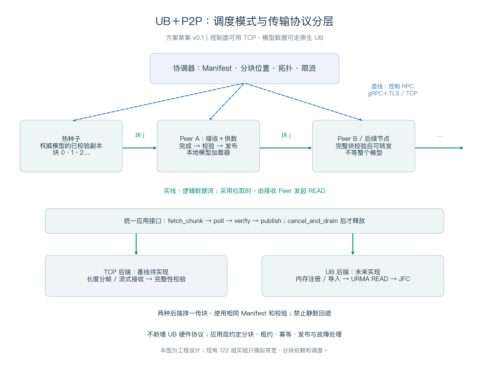
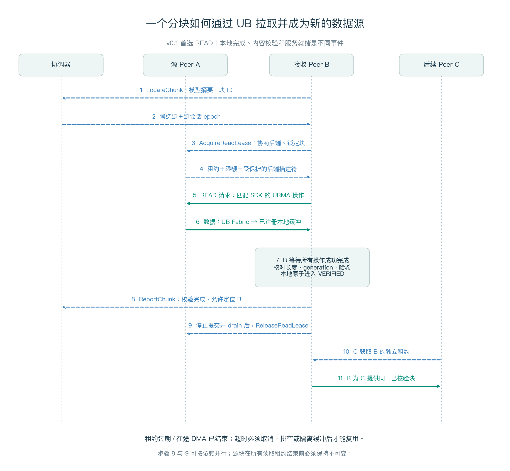

# UB＋P2P 分层协议与接口设计

**设计草案 v0.1｜2026-09-18｜待实现、待硬件验证**

本补充将方案从“带宽与分块策略”推进到“组件之间如何协作”。定义的是项目自有的应用层分发协议，不扩展或重新定义 UB 硬件协议。附带 `.proto` 可用于生成服务接口；`transport_interface.py` 只表达本地调用契约，没有实现传输后端。

## 1. 架构：P2P 与 UB 如何组合



|层次|负责内容|建议接口|实现归属|
|---|---|---|---|
|模型制品层|不可变版本、shard、文件和分块摘要|Manifest|项目定义|
|P2P 控制面|发现块、选源、租约、限流、状态发布|Coordinator / PeerControl RPC|项目定义；首版 gRPC＋TLS，底层 TCP|
|应用数据面适配|把指定块读进本地缓冲、关联完成事件|ChunkTransport|项目定义，与调度器解耦|
|TCP 数据后端|分帧传输、流控、重试边界|TcpPayload.ReadChunk|当前基线待实现|
|UB 数据后端|注册/导入内存、提交读、完成队列|URMA API|社区已有底层能力；适配器待实现|
|硬件与驱动|实际路由、传输、权限和设备访问|UB 固件、驱动、设备|依赖目标机器|

控制面用 TCP 不代表模型数据仍然 over TCP。使用 UB 后端时，大块模型字节通过 URMA 和 UB 路径传输；gRPC 只传位置、授权和完成状态。必须通过设备计数器、后端统计和回退日志确认实际路径。

P2P 不要求删除协调器。数据由节点相互提供已经构成 P2P 分发；元数据集中管理可以简化首版实现。协调器高可用和一致性存储属于后续工程任务，本草案未实现共识协议。

## 2. 分块传输时序



推荐首版采用 **pull / URMA READ**：接收方 B 确定要哪个块、拿到 A 的读租约，将其读入 B 的注册缓冲。B 可以直接判断本地接收操作是否全部完成，再校验哈希。A 的模型块必须保持只读直到相应读租约安全结束。

逻辑上数据从 A→B→C 流动；READ 请求方向相反，不应把请求箭头与数据箭头混为一谈。控制消息与模型数据分别限流。

不把 WRITE 排除为未来优化：但若改用远端写，需要额外约定目标缓冲授予、数据可见性、写后通知和接收方确认。仅看发送端返回成功，不能推导接收方完成校验、文件落盘或模型服务就绪。首版不混用两种模式。

## 3. 自定义应用控制协议

完整字段见 [protocol/model_distribution.proto](protocol/model_distribution.proto)。以下名称均为**本项目草案接口**，不是官方 UB API。

|RPC|调用方向|请求要点|响应/语义|
|---|---|---|---|
|Join|Agent→协调器|新 boot_id、后端能力、ABI profile、控制地址|分配会话与 coordinator_epoch|
|Heartbeat|Agent→协调器|会话、可用缓冲、活跃租约数|刷新存活状态；失联不等于 DMA 已排空|
|GetManifest|Agent→协调器|指定 manifest_sha256|返回不可变清单原始字节与块目录|
|LocateChunk|接收方→协调器|清单摘要、chunk_id|返回可用源的会话、地址和能力；结果只是候选|
|AcquireReadLease|接收方→源 Peer|预期源会话、块、可接受后端、是否允许回退|源再次确认块存在，锁定 generation，返回读授权和限额|
|RenewReadLease|接收方→源 Peer|lease_id、transfer_id|延长接受新操作的时间；不改变块内容|
|ReportChunk|Agent→协调器|块状态、cache_generation、单调 state_sequence|只让已校验块进入位置目录；更新丢弃旧序号|
|ReleaseReadLease|接收方→源 Peer|停止提交、在途操作已排空、租约和尝试 ID|源确认可释放该租约；无法确认时隔离，不能提前复用|

### 3.1 标识与幂等

- `manifest_sha256`：对交付的规范化 JSON 原始字节做 SHA-256；发布后不得重写这些字节。加载方校验原始字节及解析约束，不能对任意重排后的 JSON 重新哈希后冒认为同一版本。
- `ChunkSpec`：相对文件路径、文件偏移、长度、payload_sha256、shard_id。禁止绝对路径和 `..`；同一文件块范围必须覆盖预期数据且不得意外重叠；源和目标都检验边界。所有长度单位为 byte。
- `peer_id + boot_id`：每次 Agent 重启使用新的随机 boot_id，旧源描述符失效。协调器 epoch 变化必须重新加入，旧会话操作拒绝。
- `request_id`：在已认证身份、会话和 RPC 名称内去重。同 ID 同参数返回原结果；同 ID 不同参数返回错误。去重记录覆盖租约存续期及约定重试窗口；未知结果不得盲目分配第二个缓冲。
- `transfer_id`：一次尝试一个新值，与所有子操作完成事件绑定。重试换源/换后端必须生成新 transfer_id。
- `cache_generation`：区分同一内存槽的不同内容周期；完成事件还需关联本地 buffer generation。迟到完成不能把复用后的槽标成已完成。

首次 Join 的 caller 携带预配置 peer_id 与新 boot_id，coordinator_epoch=0；服务端根据已认证身份决定最终 peer_id，并返回当前 epoch。其余 RPC 必须使用返回的会话。

所有会话字段必须与 TLS 认证主体绑定，不能只相信请求中的 peer_id。协调器位置目录不保存 URMA 访问凭据；读凭据只在已授权的源和接收方之间传递，日志必须脱敏。

### 3.2 能力协商与降级

源和目标的能力交集决定后端。URMA 后端至少核对访问路径、provider/ABI profile、内存类型、最大操作长度、在途数量和可用注册缓冲。首版仅定义主机 DDR→DDR；HBM 不是默认支持项。

`selected_backend` 必须显式返回，并与响应的 oneof 描述符一致。UB 性能实验要求 `allow_tcp_fallback=false`，无 UB 能力就明确失败。业务环境可显式允许回退；先取消并排空旧尝试，分配新尝试 ID，再通过 TCP 整块重试，并统计 fallback 次数和字节。

`UrmaGrant` 的三段 bytes 是**待目标 SDK 适配的扩展点**，不是已经完成的跨厂商线格式：ABI profile 必须约定段上下文、端点上下文及凭据的编码、长度上限、权限和导入过程。严禁把进程内指针、带 padding 的 C 结构体直接复制到网络。profile 不匹配必须拒绝。目标 SDK 到位前只能验证应用层 schema，不能声称 URMA wire 互通。

### 3.3 流控、重试与错误

源同时限制活跃租约数、逻辑上传字节率和在途读取授权预算；目标根据本地缓冲/校验能力控制最大在途 byte 和操作数。逻辑分块大小、URMA WR 长度和队列深度是三个独立参数，250 MB 分块不等于一个 250 MB WR，更不等于 UB MTU。

若一个 chunk 被拆为多个操作，使用不相交且完整覆盖 `[0, length)` 的范围，只有全部完成且状态成功后才能进入 VERIFYING。任何子操作失败都不得发布半块。首版整块重试，不支持跨尝试拼接未验证数据，也不支持部分块续传。

|错误类别|建议 gRPC 状态|动作|
|---|---|---|
|未认证/未授权|UNAUTHENTICATED / PERMISSION_DENIED|停止，不自动换源绕过授权|
|无块或源已淘汰|NOT_FOUND|重新 Locate，创建新尝试|
|epoch/generation 失效|ABORTED|丢弃旧授权，重新加入或协商|
|租约过期、能力不匹配|FAILED_PRECONDITION|停止新提交；处理在途后再协商|
|无缓冲或并发额度|RESOURCE_EXHAUSTED|带退避重试或选择其他源|
|超时、设备/链路不可用|DEADLINE_EXCEEDED / UNAVAILABLE|取消＋排空；不能确认则隔离缓冲|
|长度/哈希不符|DATA_LOSS|不发布；记录来源、丢弃该块并重新拉取|

延迟/租约使用本地单调时钟，不依赖机器墙钟相等。接收端从请求发送时间保守计算有效窗口并扣除余量，续约失败停止新操作；源端时间是授权有效性的最终依据。TTL 只管理授权，不证明硬件访问已经结束。

## 4. TCP 与 UB 数据面接口

### 4.1 本地统一接口

接口草案见 [protocol/transport_interface.py](protocol/transport_interface.py)。返回的 handle 是本进程对象，不能直接放进 protobuf。

|调用|行为|调用结束不代表什么|
|---|---|---|
|prepare_buffer|预留目标缓冲；UB 后端按需注册|不代表可以被模型加载器读取|
|fetch_chunk|校验 grant，拆分并提交读/接收操作|返回不代表数据已到达|
|poll|汇聚子操作，返回整个块的本地完成结果|不代表 SHA-256 已通过或数据已持久化|
|cancel_and_drain|停止提交，确认该尝试不再访问本地缓冲|超时返回 false 不允许复用|
|release_buffer|引用清零且操作已排空后回收|不能以“RPC 超时”代替前置条件|

独立的校验/缓存层消费成功完成事件，核对 manifest、长度、来源 generation、本地 buffer generation 和块哈希，之后原子发布。状态机由缓存层拥有，传输后端不能自行把块标成可供数。

### 4.2 TCP 基线

草案使用 gRPC server-streaming `TcpPayload.ReadChunk`，它承载在 HTTP/2/TLS/TCP 上，**仅作为当前 TCP baseline 后端**。每帧含 transfer_id、块内偏移、payload 与结束标记。首版要求从零连续递增、每帧 payload≤1 MiB、不重复不重叠；最后一帧标记结束且累计长度必须等于 Manifest。中断、截断或多余字节均整块失败。

gRPC 接收窗口和消息长度上限必须配置并记录。Manifest RPC 也需设置有界大小和资源检查；大量块的分页是后续扩展。TCP 软件开销将由实机校准，不包含在现有理想带宽仿真里。

### 4.3 UB 后端与官方 API 的映射

核对来源：[openEuler URMA API Guide](https://docs.openeuler.org/zh/docs/24.03_LTS_SP3/unifiedbus/unifiedbus/urma/URMA%20API%20Guide.ch.html)，访问 2026-09-18，重点 §2.3 内存段、§2.4 完成与读写接口。以下只列官方符号和职责，不提供未经编译验证的 C 调用签名。

|阶段|官方 API / 概念|项目适配器职责|
|---|---|---|
|本地缓冲注册|`urma_register_seg`|按实际设备要求配置权限与内存范围|
|远端段导入|`urma_import_seg`|验证租约/ABI 后导入，管理有效期与引用|
|提交单边读取|`urma_read`，或 Jetty 路径的 `urma_post_jetty_send_wr`＋READ opcode|选择一种与目标 SDK 匹配的路径；拆分长度、关联 user_ctx|
|获取完成|`urma_poll_jfc`|检查返回条数、每条完成状态、尝试 ID 与子操作范围；不能只调用一次就当作已完成|
|事件等待模式|JFC 事件与 rearm/ack 机制|依据 SDK 精确实现，避免漏事件和忙轮询干扰|
|解除导入/注销|目标 SDK 对应的解除与注销接口|先停止新提交并确认 drain，再处理引用和凭据失效|

官方 API 文档在 READ 参数说明与某些注意事项的源/目的描述上存在易混淆之处；集成时必须以锁定版本的头文件、官方样例与小规模双端正确性测试交叉确认。不要复制旧版本原型后假定适用于当前机器。

## 5. 块状态机和内存生命周期

```text
ABSENT → RESERVED → FETCHING → VERIFYING → VERIFIED → ADVERTISED
                    │            │                         │
                    └─ FAILED ←──┘                    DRAINING → EVICTED
                         │
                drain/隔离后重新尝试
```

- VERIFIED：内容完整并通过哈希，允许本地加载器获得只读引用。
- ADVERTISED：已向目录发布，可以被定位；是否能授予新租约仍由源 Agent 再次检查。
- DRAINING：先发布 UNAVAILABLE、拒绝新租约，等待已有读取和本地加载引用结束。
- `VERIFIED_VOLATILE` 与 `VERIFIED_DURABLE` 区分内存可用和已达到约定持久化条件。URMA 完成不等于 fsync；本报告主仿真的终点对应内存可用，而不是 durable。
- “所有需要的块已校验”只表示模型数据就绪。反序列化、H2D、初始化与 warmup 完成后，业务才进入 SERVICE_READY。

源端在 Acquire 时增加租约引用，目标在读操作真正结束后才 Release。读失败、进程退出或网络分区时，单纯引用计数与 TTL 不足以保证安全：源必须撤销远端访问能力，并按设备支持的机制确认访问排空；不能确认时保留隔离缓冲/拒绝复用，必要时执行经平台定义的连接或设备恢复。具体 fence/drain 机制是 UB 集成验收前的阻断项。

应用 generation 能阻止旧完成误发布，但**不能阻止硬件继续写入被复用的目标缓冲**；后者必须由传输层 drain/注销和硬件保证。多 Peer 可同时读取只读块，每个 Peer 有独立租约；最后一个租约和加载器引用释放前，不能覆盖或淘汰源块。

## 6. 与现有仿真的对应关系

|仿真概念|协议实现对应|本次是否实现|
|---|---|---|
|分块转发依赖|成功完成＋哈希校验后发布|只在模拟器中检查先后关系；真实哈希未执行|
|hop_delay_s|可见性/发布/调度等抽象等待|不是本协议 RPC 时延的实测值|
|slots|活跃逻辑块窗口|实际还需独立设置在途 byte/WR 数|
|effective GB/s|数据后端、内存和网络的可用吞吐|仍是假设，不能计入未实测的 gRPC/URMA 开销|
|固定链/轮转路径|Locate 的选源策略|仿真已实现策略；RPC 调度器未实现|
|失败重试、租约、drain、回退|新增协议语义|未加入原有 122 个仿真场景|

本次只补图和接口草案，没有改变仿真算法或重跑出新的硬件结论。下一阶段先实现 TCP 后端与假传输后端的状态机测试，再适配 UB。应验证：重复 Acquire 不重复占资源、乱序 Report 不复活旧块、旧完成不污染新尝试、半块不发布、超时不提前复用、UB-only 不静默走 TCP、源退出后能够安全重选。

**建议实施顺序：Manifest/状态机 → TCP P2P → 双端 URMA READ → 多节点 UB P2P → 拓扑优化/故障恢复。** `.proto` 编译成功只能证明接口语法可生成，不能证明上述运行行为已经完成。
