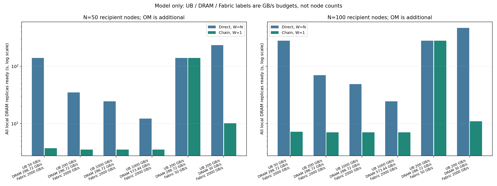

# 模型包分发：UB 带宽口径、UB-Mesh 与 P2P（公开版）

更新于 2026-09-30。本目录仅含原创分析、仿真程序、生成数据与图，以及公开资料链接。它没有 UB/昇腾实机测试，不包含需许可下载的规范文件、原文摘录或内部机器参数。所有 GB、GB/s 均为十进制单位；带宽输入是**假设**，不能称作目标 OM 的实测规格。

## 结论和方案

评估终点是 50～100 个接收节点各自在**本地 DRAM**拥有完整的 140 GB 模型包。OM 是其中一台管理节点，初始模型已预热在其 DRAM；SSD 仅是可选的后续留存任务。应先测纯 UB 单源读取，若达不到启动时限或影响在线服务，再比较现成广播/集合分发、多源和应用层分块 P2P。

```text
纯 UB：       OM DRAM ── UB 网络 ── N 个节点 DRAM
             OM 为每个节点提供一份，单源约发送 N×S

UB＋P2P：    OM DRAM ── 种子节点 ── 其他节点 DRAM
             已收到并校验的块从 Peer 本地 DRAM 再次供数
```

UB-Mesh 是可选的**物理组网/路由架构**，并非上图的应用层分块复制。华为介绍其递归直连和板内、板间、机架间 NPU 互联；[UB-Mesh 原始论文](https://arxiv.org/abs/2503.20377)强调分层局部化和训练流量的局部性。[华为产品介绍](https://www.huawei.com/cn/news/2025/9/hc-superpod-innovation) 所述的 NPU 产品拓扑，不能自动套到本项目鲲鹏 OM 与业务节点。硬件中转只改变报文路径；只有 Peer 把块存入本地 DRAM 并重新发送，才转移 OM 的供数负载。

在纯 UB 模式下，Mesh 的多路径可能缓解网络内部拥塞，却无法使 OM DDR 或 OM 端口的供数能力成倍增长。若已有硬件或集合库能在网络中真实复制数据，需单独验证它的复制位置和源端流量，不能从 Mesh 名称推断。UB＋P2P 可按物理位置选择 Peer，例如每机架设种子后在机架内扩散；种子越多，OM 初始注入量越大。跨机架割集、Peer DRAM 读写及在线服务争用仍需测量。

## 公开规格的正确口径

|对象|官方公布值|不能直接推成|
|---|---:|---|
|[昇腾 950 芯片](https://www.huawei.com/en/news/2025/9/hc-xu-keynote-speech)|互联带宽 2 TB/s|鲲鹏 OM 从 DDR 发模型的持续单向有效带宽；该发布页也未给出这里所需的方向/载荷口径|
|[跨柜 UB LinkDevice](https://www.huawei.com/en/news/2026/9/hc-lingqu-agent-ai)|176 口，每口 1.6 Tbit/s＝200 GB/s；整机约 280 Tbit/s|单 OM 独占整机约 35 TB/s 聚合带宽|
|[LingQu 630 V1](https://e.huawei.com/marketingcloud/pep/asset/20000001/Material/60d705434c01491f94dad153fab71db7/M3T1A669N1253094282109296691/Atlas%20800T%20A3%E7%A1%AC%E4%BB%B6%E5%BD%A9%E9%A1%B5-%E4%BA%92%E8%81%94%E7%BD%91%E5%90%8E%E8%AE%AD%E7%BB%83-%E5%BD%A9%E9%A1%B5_26H1_.pdf)|48 个 400 Gbit/s 端口，每口 50 GB/s|一个只占一口的 OM 有 48×400G 出口|

所以“UB 的上限就是 1 TB/s”不成立。此前案例中的 1000 GB/s 是参数扫描输入，既非标准固定速率，也非目标机器实测；NPU、交换设备和 OM 是三个不同口径。尚需取得目标 OM SKU 的端口数量、方向与协议载荷吞吐、DDR 持续读速率、内部路径、拓扑和接收端写入速率。

## 可核算的资源模型

令 `S=140 GB`，`N` 为接收节点数，`U` 为 OM 用于模型的单向有效 UB 载荷预算，`D` 为 OM 在在线服务保留资源后可用于模型的持续 DRAM 读带宽，`H` 为其他 OM 内部路径上限，`F` 为当前拓扑允许的全局交付预算。忽略校验、复制、重传和服务加载时，纯单源完整复制的必要时间下界是：

```text
B_source = min(U, D/a, H)
T_direct ≥ max(N×S/B_source, N×S/F, 接收端写入和拓扑割集下界)
```

`a` 是每交付 1 字节产生的 OM DRAM 读字节数；下方冷数据、无额外拷贝案例取 `a=1`。实际缓存、复制引擎或内存映射会改变这一系数，必须用源端计数器测。只有在同一 OM 的 `U>D/a` 且 `H` 不更低时，才能说源 DRAM 先到上限。**N 增加会分摊同一个源的能力，不会凭空改变 DDR 和 UB 谁先到上限。**

以通用算术示例 DDR5-6400 为例，一个 64-bit 数据通道理论峰值为 `6400 MT/s×8 B=51.2 GB/s`。假设 8 通道、持续可用率 70%，可用预算为 `286.72 GB/s`；70% 不是目标机器实测效率，8 通道也不是目标 OM 已核实配置。[Micron DDR5 官方资料](https://www.micron.com/products/memory/dram-components/ddr5-sdram)可用于核对 DDR 类型和量纲。若再**假设** OM `U≥286.72 GB/s`，50 节点的纯单源资源下界是 `7000/286.72≈24.414 s`，100 节点是 `14000/286.72≈48.828 s`。若 OM 只有一个 400 Gbit/s 端口，标称上限是 50 GB/s；若只有一个 1.6 Tbit/s 端口，标称上限是 200 GB/s，尚须扣除协议和争用。此时须按端口而非 2 TB/s NPU 宣传值重新判断。

## 可复现实验及限制

`analyze.py` 复用上级目录的原创 `simulator.py`，扫描 54 个解析条件和 32 次分块调度场景；`plot_sensitivity.py` 用结果生成 `sensitivity.png`。每个节点接收至本地 DRAM，块大小 0.25 GB。基准假设 OM 已预热、无 SSD、无缓存复用、无重试和校验耗时；同一场景的端点、DRAM 和 fabric 带宽均为假设预算。`F` 以端点交付字节计一次，不是任意真实 Mesh 网络的逐跳链路总容量。固定链 P2P 是可解释对照，绝非生产推荐的最优调度。

|假设案例，单位 GB/s|N|纯单源模拟 s|固定链 W=1 模拟 s|解释|
|---|---:|---:|---:|---|
|OM 端点 200，DRAM 286.72，F 2000|50|35.000|3.522|Peer 帮 OM 分担源出口，但要求多个端点及 fabric 真有该余量|
|同上|100|70.000|7.022|多节点总体交付量也翻倍|
|OM 端点 1000，DRAM 286.72，F 2000|50|24.414|3.521|纯单源先受示例 DRAM 限制；1000 非实机规格|
|同上|100|48.828|7.021|仍要核对机架割集与 Peer 混合读写|
|OM 端点 200，DRAM 286.72，F 50|50|140.000|140.000|全局交付预算先到顶，P2P 无法改善|
|同上|100|280.000|280.000|拓扑不能只看端口总和|



这些数值仅说明**什么条件下值得测 P2P**，不是生产启动耗时。模型未模拟真实 UB 硬件转发、UB-Mesh 路由、各机架割集、模型加载到 NPU、在线 KV cache 干扰及故障恢复。取得机器后需要分别测：OM DRAM 持续读取、OM UB 单向载荷、不同节点数同时拉取、Peer 本地读写和业务 p95/p99、跨机架流量与完整服务 READY 时间。现有 Ascend＋鲲鹏 TCP 环境可验证测试方法和策略敏感性，不能充当 UB 硬件吞吐证据。

从仓库根目录复现：

```bash
python3 -m venv .venv
.venv/bin/pip install -r outputs/ub_p2p_study/requirements.txt
.venv/bin/python outputs/ub_p2p_study/public_update_2026-09-30/analyze.py
```

程序会重写本目录的 `results.json`、`results.csv` 和 `sensitivity.png`。该更新与先前的完整研究报告并存，不覆盖历史仿真结果。
