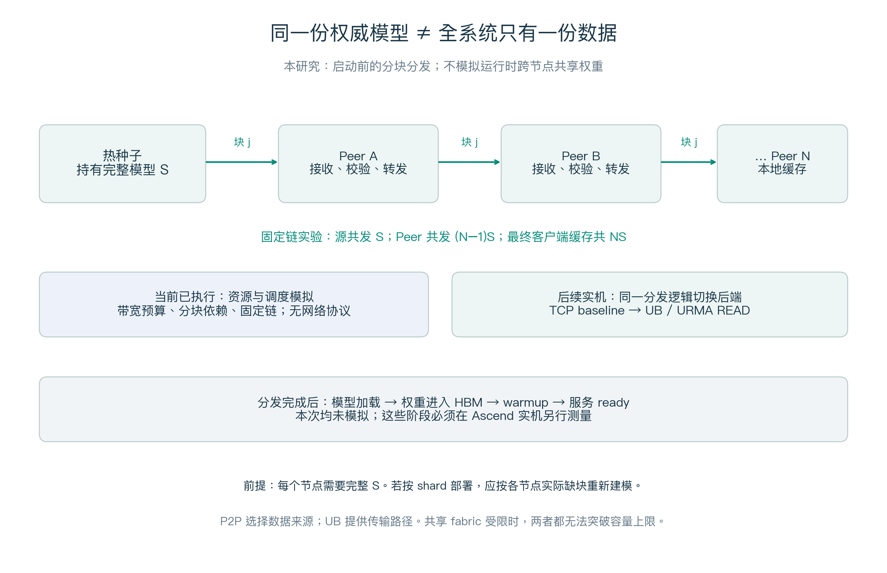

# UB＋P2P 模型分发研究报告

**技术自审修订版 v2｜2026-09-18｜阶段：策略仿真完成，TCP 与 UB 实机测试均未执行**

**2026-09-20 补充研究：** [UB 带宽/功耗、Mooncake 内存共存与 SSD 分发演进](ub_capacity_memory_evolution.md)。新增具体设备规格例子和 64 个解析容量配置，未新增实机结果。

## 1. 结论与研究对象

UB 与 P2P 可以分层组合：P2P 决定“哪个节点把哪个块提供给谁”，UB 数据后端负责节点间传输。当前证据支持继续做原型和实机验证，**尚不能证明目标机器上的 UB＋P2P 性能、互通性或工程可行性**。已完成的是带资源约束的分块分发模拟，没有执行 TCP/URMA，也没有使用 Ascend 或鲲鹏实机。

本项目研究的是**服务启动前分发模型制品**。必须区分三个问题：

|问题|实际含义|本次覆盖情况|
|---|---|---|
|共享访问|多节点运行时直接访问同一份远端权重/内存对象|未模拟；需额外验证框架、内存语义与计算访问路径|
|启动分发|将所需模型文件/块送到节点本地缓存|本次仿真的对象|
|模型加载|解析文件、分配设备内存、拷贝权重、初始化与 warmup|未模拟；纳入后续服务 ready 测量|

因此，以下“单源”表示一个种子给各节点传送文件数据，**不等于 UB 远端共享内存推理**。以下实验中的 P2P 具体实现为固定链式分块转发，不代表自适应 swarm 的最佳性能。



## 2. UB 依赖什么硬件，是否就是 DPU？

UB 是互连体系，不能等同于一张 DPU 卡。可用路径依赖端点的 UB 能力、设备/控制器、连线或交换拓扑，以及固件、驱动和用户态软件。DPU 可以是系统中的端点或卸载组件，但不能从“有 DPU”推出“支持目标 UB 路径”，也不能从“有 Ascend＋鲲鹏”推出“现有服务器支持 UB”。CPU、NPU、DPU 的具体型号、代际和连接方式必须逐项确认。[UB 软件架构白皮书](https://www.openeuler.org/projects/ub-service-core/white-paper/UB-Service-Core-SW-Arch-RD-2.0-zh.pdf)、[URMA 用户指南](https://docs.openeuler.org/zh/docs/24.03_LTS_SP3/unifiedbus/unifiedbus/urma/URMA%20User%20Guide.ch.html)。

URMA 是拟采用的应用访问接口层，不能仅凭“调用 URMA 成功”判断实际数据走 UB。未来必须记录 provider、设备、版本、拓扑和设备计数器，并关闭自动 TCP 回退后验证。原型先限于主机 DDR→DDR；不预设远端数据能够直接进入 Ascend HBM。[URMA API 指南](https://docs.openeuler.org/zh/docs/24.03_LTS_SP3/unifiedbus/unifiedbus/urma/URMA%20API%20Guide.ch.html)。

社区资料的用途与证据强度如下。文档核对日期为 2026-09-18；在线页面可能滚动更新，正式硬件测试必须归档 SDK/驱动版本及对应文档快照。

|资料|本研究采用的信息|不能据此推导的结论|
|---|---|---|
|URMA API / 用户指南|注册/导入内存、READ、完成队列等接口与示例部署|本项目 100 节点一定可连通，或达到某个吞吐|
|[UMDK 社区源码](https://github.com/openeuler-mirror/umdk)|适配实现的源码入口|本项目已实现 URMA 后端|
|[openYuanrong UB 实践](https://pages.openeuler.openatom.cn/openyuanrong-datasystem/docs/zh-cn/latest/best_practices/best_pracitces_for_ub.html)|优先评估已有数据系统的 UB 能力与复用条件|现有产品开箱即满足本项目文件分发语义|
|[Dragonfly 客户端架构](https://d7y.io/docs/next/operations/architecture/components/client/)|P2P 分块缓存/调度可借鉴的现有工程|该组件已有可直接替换的 UB 后端|

用户指南性能例子中的 DPU 单 IODIE、8 KB、32 流“170Gb”是特定案例，原文单位写法也需确认；不能把它作为所有设备规格。本报告的 10/40 GB/s 均为假设有效载荷参数，未采用该案例反推硬件能力。

## 3. “只保留一份”到底指什么？

可以维护一个权威模型版本，节点按需缓存；但这不意味着全系统只有一份物理数据。P2P 必须在节点保留可供转发的块；本仿真最终每个客户端保留完整模型，所以 N=100、S=140 GB 时客户端逻辑缓存总量为 14,000 GB，另有种子数据。若要求落盘，还应计入磁盘占用；如果缓存只在内存，不能称为持久副本。权威仓库的高可用副本和备份也应另行计算。

更关键的是，**50～100 台服务器未必各需要完整模型**。如果模型由多机张量/流水并行组成，一组服务器可能各需不同 shard。设块 j 大小为 s_j，节点 i 是否需要它为 D_ij，则接收总量为 `V = Σ_i Σ_j D_ij × s_j`。本报告使用 D_ij=1 的全量复制压力场景，V=NS；现场应先量出需求矩阵，不能直接把服务器数代入完整副本公式。考虑节点已有缓存时，只计尚缺数据。

P2P 也不能消除读取需求。在这里，它把源端供数分散到多个 Peer，从而可能降低源端拥塞；全网累计模型载荷仍为 NS，瞬时聚合流量甚至可能更高。若共同机架出口或全局网络已经是瓶颈，增加 Peer 不会凭空增加这条共享路径的容量。

## 4. 建模、规格和可核算的结果

统一使用十进制 GB、GB/s 和秒：1 GB/s=8 Gbit/s。代码沿用历史字段 `*_gbps`，实际含义均为 **GB/s**。所有结果是逻辑有效载荷，不是线速、逐交换跳字节或磁盘 IO。

|参数|理想基准值|含义与限制|
|---|---|---|
|客户端 N|50、100|不含种子机器；各需完整 S|
|模型 S|140 GB|近似 700 亿参数×2 byte 的纯权重；不是完整部署包实测|
|分块 c|0.25 GB|逻辑块；不是 MTU 或单次 URMA WR 大小|
|源上传、Peer 上传、客户端下载|各 10 GB/s，另扫 40 GB/s|假设持续有效速率；源与客户端资源分别计费|
|每发送端活跃块 W|理想基准为 1|后续扫窗口；不同窗口的结果必须单独标注|
|每跳附加延时 L|20 μs|简化的块发布延时；非硬件测量|
|共享 fabric、机架、sink、内存|理想基准不限制|代码用 10⁹ GB/s 哨兵表示；绝非设备规格|
|资源分配|活跃流 max-min 公平|忽略报文拥塞控制、CPU、哈希、故障和真实落盘|

设源可供出速率为 B_s，最慢客户端接收速率为 d_min，全网逻辑传输预算为 F。全量复制时：

```text
单源完成时间下界：T ≥ max(NS/B_s, S/d_min, NS/F)
P2P 完成时间下界：T ≥ max(S/B_s, S/d_min, NS/(B_s+Σu_i), NS/F)
```

其中 u_i 是各 Peer 上传能力。P2P 下界是必要条件，不保证可达，未表达所有拓扑割、依赖、存储和调度开销。N=100、S=140 GB、B_s=10 GB/s 时单源供数至少 1,400 秒；50 节点对应 700 秒。线速应先按 `B_eff = 线速(Gbit/s)÷8×有效率` 换算，并与供数内存/存储的可持续速率取约束，不能直接填入端口宣传值。

只有在等速 B、固定链、W=1、S 恰好分成 M 块、其他资源不限制的条件下，流水线闭式为：

```text
T_chain = (M+N−1)c/B + N L
         = (560+100−1)×0.25/10 + 100×0.00002
         = 16.477 秒
```

这要求多个节点同时供数：中间 Peer 同时接收和发送各 10 GB/s，模型中的共享内存载荷预算至少要覆盖约 20 GB/s；真实内存流量还取决于额外复制与校验。该案例平均聚合载荷约 850 GB/s、峰值 1,000 GB/s，**不能据此预测现有 TCP 或未来 UB 实机能在 16.477 秒完成**。

### 4.1 选取具有解释价值的对照

除注明项外，N=100、S=140 GB、c=0.25 GB。下表时间来自历史记录；单源受限场景采用 W=100，链式采用 W=1，反映明确配置下的比较，不声称双方都已全局调优。

|条件|单源时间（秒）|固定链时间（秒）|说明|
|---|---:|---:|---|
|理想基准，源/Peer 各 10，两者 W=1|1,400.000|16.477|条件最强；用于核对闭式|
|共享 F=10 GB/s|1,400.000|1,400.000|共享总容量抹平策略优势|
|共享 F=100 GB/s|1,400.000|140.225|全网容量成为主要限制|
|客户端接收 sink=1 GB/s|1,400.000|164.752|接收处理限制使流水线变慢|
|客户端收发共享内存预算 10 GB/s|1,400.000|32.902|收发争用资源|
|源 200 GB/s，Peer 上传仅 1 GB/s|70.000|164.527|真实的策略反例：该链式方案更慢|

单源、多种子和固定链的完整扫描见[实验附录](experiment_details.md)。4/8 个热种子的 350/182 秒结果使用额外预加载机器；预热成本不在计时内，不是零成本增加副本。8 个种子分配 100 个客户端不均衡，所以是 182 秒而非简单除法的 175 秒。

原文强调的“源端字节减少 99%”是固定链每块只从源注入一次的**构造性质**：源发送 S，Peer 共发送 (N−1)S；它验证计账一致性，不是独立发现，也不证明整体吞吐提升。另一个 261.502 秒的反例来自 W=100 FIFO 调度，不应当作所有 P2P 的固有性能特征。

### 4.2 已完成验证的强度

历史数据有 **122 条运行记录、113 个不同完整配置**；重复配置不能当作独立统计样本。模拟器是确定性的，随机拓扑种子扫描也不等于真实网络的时间波动或置信区间。当前验证包括字节守恒、资源容量约束、闭式与退化场景、输入校验，以及对代表性历史场景重新计算；具体输出见[审核记录](audit_review.md)。原始 results.json/csv 保留，不把本轮文案修订描述成重新执行全部实验。

## 5. 组合方案和必要接口


图中保留 Easysuit、Job、HOFS 缓存和推理服务，新增节点 P2P Agent；P2P Service 负责元数据与控制。节点 1 被选为预热种子，因此图中的 N 个业务节点含种子；历史仿真的 N 则不含额外种子，两者计数不可直接混用。存储可达路径、HOFS 接口和备份职责仍待确认，详见 [草图映射说明](deployment_notes.md)。

建议先确定能否复用现有缓存/数据系统，再决定是否开发自有服务。最小方案只需清楚定义以下职责；并不要求立即实现完整调度平台。

|组件/接口|输入与输出|必须保证的语义|
|不可变 Manifest|模型版本→文件、shard、块偏移/长度、摘要|相同摘要绑定相同字节；明确节点需求|
|LocateChunk / 块目录|块标识→可提供该块的 Peer|返回候选，源需再次确认；只发布已校验块|
|AcquireReadLease / 授权|接收方能力＋块→只读授权、有效期、传输参数|会话绑定、能力协商、内存生命周期安全|
|ChunkTransport.fetch_chunk / poll|授权＋本地缓冲→传输完成事件|TCP 和 URMA 适配同一应用契约；记录实际后端|
|校验、发布、释放|完成字节→校验→发布→安全释放|传输完成不等于校验完成，更不等于 service ready|

UB 模式拟采用接收方发起 URMA READ，大块数据从源 Peer 进入接收方主机缓冲；TCP 可以继续承载少量控制消息。P2P 描述分发关系，TCP/UB 描述传输路径，它们不是互斥概念。当前 TCP 环境用于比较分发策略；未来 UB 后端的模型数据不应经过 TCP，必须用计数器和禁止回退验证。

[协议草案](protocol_design.md)及 `.proto` 是**项目自定义、尚未实现的原型契约**；不属于官方 UB 协议。编译 schema 只证明语法可生成。URMA 导出描述符仍需绑定目标 SDK/ABI；安全撤权、在途排空、故障恢复和双端互通都未验证。重启 ID 不能代替硬件撤权，READ 授权数量也不能代替强制硬件限速。这些都是项目实施门槛。

## 6. 当前 TCP baseline 与未来 UB 验证计划

执行规程见 [baseline_protocol.md](baseline_protocol.md)，当前没有任何已执行的 Ascend＋鲲鹏 TCP 实机成绩。

|阶段|实验设计|能回答的问题|
|---|---|---|
|0 现场盘点|型号/拓扑/版本、需求矩阵、模型大小、内存/盘/网络微基准|场景和资源参数是否真实|
|1 TCP 同机群对照|单源、4/8 热种子、固定链；相同数据/缓存/校验；双方扫并发并调优|转发是否降低源端压力，瓶颈是否迁移|
|2 实测参数校准模拟器|输入有效吞吐及共享约束；比较预测和实测误差|简化模型在哪些条件下可用|
|3 UB 双节点|先 DDR→DDR READ，确认 provider/ABI、权限、完成和释放|底层路径及接口是否实际可用|
|4 UB 同机群 2×2|TCP/UB × 单源/链式，保持其他条件尽量一致|目标系统中的策略收益和后端差异|
|5 服务验收|完整加载、HBM、warmup、故障/扩缩容、持续资源占用|最终服务启动收益与可靠性|

至少记录：分发完成 p50/p95/全体完成时间、服务 ready、源/Peer/机架峰值与累计字节、CPU/内存/盘、缓存占用、失败重试及回退。50/100 节点可分阶段扩展；只有同机进程模拟时要明确它不代表 50/100 台独立硬件。

2×2 实验不自动给出“纯 UB 硬件收益”：TCP/TLS 与 URMA 的加密、复制、队列和 CPU 路径可能不同。应匹配安全/校验语义并记录不能消除的差异，用微基准与资源计数器解释端到端结果。

## 7. 决策与交付状态

现在可以申请以验证为目标的原型项目：先证明目标负载确实受单源供数约束，再测试 P2P 是否利用了可用的 Peer 和网络容量，最后替换 UB 后端。不要用 16.477 秒或 99% 源流量下降作项目性能承诺。

交付阅读顺序：本报告 → [审核问题与修订](audit_review.md) → [实验细节](experiment_details.md) → [实机规程](baseline_protocol.md) → [协议草案](protocol_design.md)。源码与原始数据均在同目录；本地路径与分支见 README。待补证据是硬件配置、现场 baseline、URMA 适配/互通和端到端加载效果。
