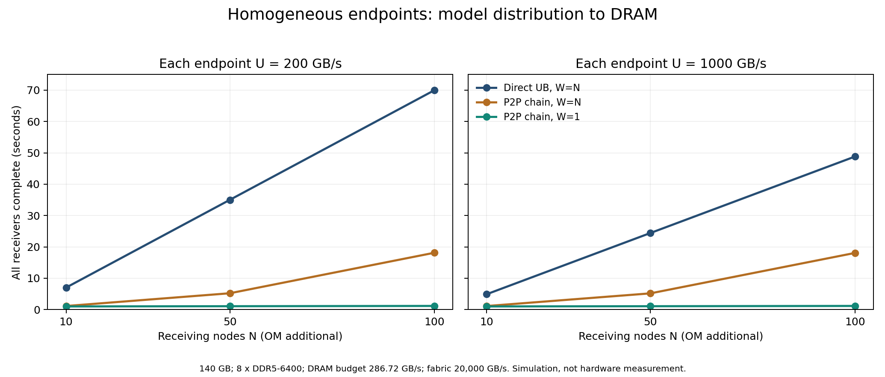

# UB 内存管理、同读规模与 P2P：综合方案判断

更新：2026-09-28。范围：140 GB 模型部署包从一个已预热的 OM 分发；OM 与业务节点使用相同硬件、相同 UB 接口配置。这里 N 是接收节点数，集群总数为 N+1；若集群总数为 50，公式中代 N=49。GB、GB/s 均采用十进制。

**判断：集中只读 UB 是合理的首选基线，不能仅因有 50～100 个节点就断定必须 P2P。是否演进，取决于截止时间内 OM 的实际供数预算、接收节点 DRAM 的写入/转发预算、fabric 容量及业务干扰。UB 内存管理使远端内存可被安全访问，但不会使一份 OM 物理内存自动成为多个独立供数源。**

**评估终点：所有接收节点的本地 DRAM 中完整模型包就绪，并满足约定的内存可见性与完整性条件。SSD 仅用于可选的后续留存，不是分发成功或模型可用的前置条件，不进入本次速率/时间公式。OM 预热、实际校验开销、模型加载及服务 READY 分阶段记录；本次仿真未计校验耗时。**

## 1. 原文核对与版本边界

已核对用户从 [灵衢官网](https://www.unifiedbus.com/en)下载的《UnifiedBus Base Specification》**2.1，2026-09** 原文，共 613 页。文件位于 `/Users/shijieluan/workspace/UnifiedBus-PV-Transfer/UB-Base-Specification-2.1.0-en-clean.pdf`，SHA-256：`641a10ffcf48789af6f2392e8faab330b6d1e3d1fa447750ece7cd4ef578df82`。同时核对 OS 参考设计 2.0 的第 4 章和 §5.3。此前引用的 2.0 镜像仅保留为历史资料，不再作为当前版本核对的替代。

|核对位置（2.1 PDF 页码与印刷页码一致）|规范事实的概括|本方案的工程判断|
|---|---|---|
|§9.1～9.2，p311～312，图 9-1|Home 拥有物理内存；User 访问它；Home 侧 UMMU 做转换与访问控制|所有描述符仍指向 OM 的同一内存时，增加 User 不等于增加物理供数源|
|§9.3～9.4.1，p312～314|UBMD 包含 EID、TokenID、UBA；通过映射与权限表访问物理地址|描述符用于访问定位及授权，不是模型副本，也不保证目标数据在访问者本地 DRAM|
|§9.4.4.3.4～5，p341|检查读、写、原子操作权限并综合转换权限|分发已发布模型可只授读权限；权限与版本生命周期一起管理|
|§9.5，p341～343|User 侧 Decoder 将地址转换成远端 UBMD|远端映射不能直接计为 Peer 本地副本|
|§8.2.6，p298～301，图 8-9|区分借用和共享；共享允许多读者，给出 Ownership/缓存维护参考机制|只读共享适合模型访问；发布前完成写入和可见性处理，更新使用新版本|
|OS 参考设计 2.0 §4.2.2、§4.3.2，p19～22|IMPORT 上线为 NUMA node 或 char device，共享 mmap 直接使用远端内存|本地完整包就绪需要显式复制到接收者物理 DRAM；不能用映射成功替代|

没有“一条 DDR 通道只能服务一个节点”或“应用 OM 必须使用低速 UB”的规定。通道数决定物理供数能力，访问关系由地址、权限、路由和资源配置决定，两者不是一一对应。

OBMM、Load/Store 共享映射与 URMA 异步复制分别按其接口与可见性契约实现；不能把所有模式合并成同一个内存管理流程。基础规范 §8.2.6 允许软硬件实现选择，不能假定所有部署具有自动全域缓存一致性。**lane/端口速率、低功耗机制、广播/组播和全局缓存的进一步核对见 [官方文档原文评审](official_docs_review.md)。**

## 2. 三种不同的数据路径

```text
A. 集中只读 UB
   OM 的本地 DRAM [完整模型 / Home]
       ├─ UB 独立读取 → 节点 1 本地 DRAM
       ├─ UB 独立读取 → 节点 2 本地 DRAM
       └─ UB 独立读取 → 节点 N 本地 DRAM
   每个接收节点获得本地完整副本，这是本次 DRAM 就绪终点。
   若只导入 OM 的远端映射，则属于另一种共享访问方案，不算本地副本就绪。

B. UB + P2P
   OM 本地 DRAM → UB → 节点 1 本地物理块 → UB → 节点 2 本地物理块 → …
                          │                          │
                          └─ DRAM 本地模型加载       └─ DRAM 本地模型加载
                          （SSD 后续留存可选，不阻塞 DRAM 就绪）
   Peer 只有获得本地可供数副本，才能真正分担 OM 的读取。

C. 多 Home 的池化 / 分片
   OM 管理 manifest，模型块分布在多个物理内存节点。
   接收者按块定位不同 Home，供数预算可跨 Home 聚合。
   这是布局和存储服务设计；仅把一个 OM 地址映射到全体节点不产生此效果。
```

§8.2.6 提到池化能够提升单节点可用内存带宽，这与单源限制不矛盾：当一个使用者访问分布于多个 Home 的数据时，可聚合多个物理内存控制器的能力；若同一模型仍完整地只放在 OM，其他节点的闲置内存通道不会自动参与供数。要用上它们，需要实际分片、复制或可验证的硬件缓存/复制机制。

A 和 B 都可以使用原生 UB 数据面，例如 URMA 异步读写；B 是应用层分块传播策略，不是 over TCP 的同义词。Load/Store 直接访问是另一种编程路径，应单独测顺序吞吐，不能把一次加载延迟或协议峰值当作文件分发吞吐。控制面使用何种 RPC 不改变数据面是否使用 UB。

三种路径均需有模型版本、长度、块哈希和完成状态。UB 内存映射本身不提供文件路径、SSD 持久化确认或模型版本切换。

## 3. 带宽模型：先明确单位和物理位置

设每节点完整 64-bit 数据宽度的 DDR 通道数为 C，传输率为 R MT/s：

```text
D_peak = C × R × 8 / 1000                         [GB/s]
D_available = 实测可持续带宽 - 业务预留预算          [GB/s]
示例计算用 D_available = η × D_peak，η=0.70
B_OM = min(U, D_available/a, H)
B_destination = min(节点 UB 接收预算, 节点 DRAM 写入预算, 接收侧内部路径预算)
T_direct >= max(N×S/B_OM, S/B_destination, N×S/F)
```

U 是**单个同构节点**的 UB 有效单向载荷总预算，聚合该节点可同时使用的端口，不是单交换机所有端口的总和；H 是片上互连、跨 NUMA、内存访问引擎等路径的实际限制。F 是全网应用载荷总吞吐预算，每个源到目的传输字节计一次；它不是交换机物理端口双向带宽总和。真实部署还需验证各拓扑割集。

a 是源端每发送一字节引起的 DRAM 流量。以下采用 a=1、预热数据、无额外拷贝；未计算硬件 cache 重用。请求同步、缓存容量与请求合并可能使 a 降低；校验、拷贝、页表访问等可能提高开销。**因此 N×S 是本模型中的源网络载荷，不是任意 UB 实现必然产生的 DRAM 物理读取量。** 需要用内存控制器计数器验证 a。独立单播基线不假定硬件广播/多播；若设备和软件提供可用的复制卸载，应另建实验。

DDR5 的两个 32-bit 子通道合计为上述 64-bit 数据宽度，不再额外乘二。ECC 位不计作模型有效载荷。通道数不是 DIMM 数：同通道增加 DIMM 通常增加容量，可能降低实际速率；跨 socket 聚合需数据实际分布及访问路径允许。[Micron DDR5 模块说明](https://assets.micron.com/adobe/assets/urn%3Aaaid%3Aaem%3A5902f17e-8bde-4246-971c-8d7f274c6b1a/original/as/ddr5-key-module-features-wp-client.pdf)说明双子通道结构。

以下参数用于敏感性分析，**不是某款 UB 服务器或鲲鹏 CPU 的承诺规格**。η=70% 也是建模假设，不是实测效率；不同读写配比应分别校准。

|DDR5-6400 通道数 C|理论峰值 GB/s|示例可用预算 GB/s|U=200 GB/s 时先限速|U=1000 GB/s 时先限速|
|---|---:|---:|---|---|
|8|409.6|286.72|UB|DRAM|
|12|614.4|430.08|UB|DRAM|
|16|819.2|573.44|UB|DRAM|

U=1000 GB/s 是有意设置的强互连假设。即使节点 UB 能达到此速度，8 通道 DDR5-6400 也不能持续提供 1000 GB/s 的单源 DRAM 数据。按本假设，满足 1000 GB/s 需要至少 `ceil(1000/35.84)=28` 条这样的通道，且其余路径全部能承载；这只是带宽必要条件，不是在断言存在该 28 通道产品。按峰值计算也需要至少 20 条。

## 4. 纯 UB：节点数量增加时会发生什么

本表取 C=8、η=70%、S=140 GB、F=20000 GB/s、H 不限，全部节点同步独立读取完整模型。数字是传输完成时间的**资源下界**，未包括 OM 从 SSD 预热、模型反序列化、加载到加速器、编译、启动探活，也不代表实机时延。

|接收节点 N|集群总节点|U=200 GB/s，DRAM 就绪下界（秒）|U=1000 GB/s，DRAM 就绪下界（秒）|
|---|---:|---:|---:|
|1|2|0.70|0.49|
|10|11|7.00|4.88|
|50|51|35.00|24.41|
|100|101|70.00|48.83|
|200|201|140.00|97.66|

同构意味着各节点拥有相同峰值能力，并不意味着单个 OM 的发送预算会随接收节点增加。8 通道被多个请求交错共享。N 增加后，平均节点带宽约为 `B_OM/N`；不是按节点独占一条内存通道，也不是每条连接都获得一个完整 U。

例如 N=50、U=200 时，集中同读平均给每节点约 4 GB/s；这里的 4 GB/s 是 OM 总供数预算被 50 个接收者共享的结果，不能用可选 SSD 的速率去限制它。P2P 若通过多个 Peer 的本地 DRAM 同时供数，有机会提高每节点实际接收速率，收益受 Peer 收发合计 DRAM 预算和全网容量约束。N=100 时集中同读平均约 2 GB/s，仍按相同的 DRAM 就绪标准比较两种方案。

给定目标 T，源端允许的接收规模必要条件为：

```text
N <= floor(B_OM × T / S)
同时要求 B_destination >= S/T，F >= N×S/T，并满足各实际拓扑割集。
```

|C|U GB/s|源供数预算 GB/s|10 秒目标的 N 上限|30 秒目标的 N 上限|
|---|---:|---:|---:|---:|
|8|200|200|14|42|
|12|200|200|14|42|
|16|200|200|14|42|
|8|1000|286.72|20|61|
|12|1000|430.08|30|92|
|16|1000|573.44|40|122|

反过来按截止时间规划通道数，在 a=1、DDR5-6400、η=70% 下，`C_min = ceil(N×S / (35.84×T))`，还需 `U >= N×S/T`。例如 50 个接收节点在 10 秒内完成 140 GB，每个 OM 必须提供 700 GB/s，内存至少需等效 20 条上述通道；100 个接收节点则需 1400 GB/s 与等效 40 条。这里“等效通道”是算术资源需求，不代表具体 CPU 支持这些配置。若 OM 的 U=1000 GB/s，100 节点 10 秒目标已被 UB 预算否决，继续添加 DRAM 通道也不能补救。

这些是必要条件，不能当成保证。除 OM 供数外，还必须满足接收节点 DRAM 可持续写入、可用容量、全网拓扑及在线业务预算。可选 SSD 留存的速度不参与该判断。

## 5. UB + P2P：解决什么，又消耗什么

本研究中的固定链把每个模型块从 OM 注入一次，后续由持有本地块的 Peer 转发。OM 发出载荷由 N×S 降到 S，集群应用传输总量仍为 N×S。不是 UB 改变了 OM DRAM 的物理上限，而是实际供数位置扩展到多个节点。

一个普通中继收到完整模型并转发一次，在本模型中对本地 DRAM 至少产生 S 的接收写入和 S 的转发读取。因此 N≥2 时，链式方案有如下必要下界：

```text
T_chain >= max(S/min(U,D), 2S/D, NS/F)
```

这里 D 是相同的可用 DRAM 收发合计预算。上述 2S/D 适用于每个完整包接收一次、转发一次的普通中继；最后一个接收节点不需要转发。校验、额外拷贝和模型加载会消耗额外 DRAM 带宽，应在真实实现中测量并预留。SSD 留存不是转发或模型可用的前置条件。

### DRAM 容量与 Mooncake 共存

按本次全量副本方案，每个接收节点需要存放完整 S=140 GB 模型包。50 个接收节点合计需要 7000 GB，100 个需要 14000 GB，另计 OM 的 140 GB。这是分布在各机器上的容量，不能仅看集群总空闲内存。

```text
每节点可用物理 DRAM >= 完整模型包 S
                    + 不与包存储重叠的接收/注册缓冲
                    + 该阶段加载/校验工作区峰值
                    + 安全余量
可用物理 DRAM = 物理容量 - Mooncake 等服务占用 - 其他常驻占用
```

共享映射、别名和复用缓冲须去重。若直接把接收目标注册到完整模型包存储区，不应再机械重复计算一份 S。若内存不足，应调整部署并发、服务预留或内存资源；不能用“只有少量 DRAM 缓冲，完整包写 SSD”替代当前的 DRAM 就绪要求。

P2P Peer 在转发时还需保留被读取的块。模型加载与 Peer 租约结束前不能复用或释放这些块；加载后是否保留包由后续策略决定。SSD 可用于可选的后续留存，以供重启或回滚。在主性能对照中关闭该任务，或延后到 DRAM 就绪后启动；若另测同时留存，额外 DRAM/IO 干扰须单独报告，不能混入主结果。

若 Peer 只是再次读取 OM 的远端映射，就没有获得本方案预期的源端卸载。真正的供数分散需要 Peer 本地 DRAM 中有可访问、不可变且仍有效的块副本。

## 6. 新增同构实验：下界与调度结果分开

运行 `python outputs/ub_p2p_study/memory_scale_analysis.py`，输出独立的 `memory_scale_results.json`，不覆盖历史实验。新增 30 个解析配置和 36 次分块流体离散事件仿真。参数：140 GB，250 MB 块，每跳发布延迟 20 μs，全网载荷预算 20000 GB/s，源与接收节点同构，内存数据已预热，终点为 DRAM；8/16 通道、U=200/1000 GB/s，N=10/50/100。

纯 UB 的源并发窗口 W=N，允许同时服务全体节点。P2P 分别测试 W=N 与每个发送端 W=1，保持相同硬件预算，显式展示调度敏感性；不能把两种窗口混在同一条“P2P 性能”曲线中。仿真包含收发合计内存预算，不包含缓存一致性协议、具体 UMMU 时延、丢包、故障、校验、SSD 或业务负载。

<!-- SIMULATION_TABLE -->
|C|U GB/s|N|纯 UB W=N 秒|P2P W=N 秒|P2P W=1 秒|
|---|---:|---:|---:|---:|---:|
|8|200|10|7.000|1.124|0.991|
|8|200|50|35.000|5.196|1.062|
|8|200|100|70.000|18.129|1.150|
|8|1000|10|4.883|1.116|0.991|
|8|1000|50|24.414|5.163|1.061|
|8|1000|100|48.828|18.068|1.149|
|16|200|10|7.000|0.813|0.711|
|16|200|50|35.000|3.764|0.762|
|16|200|100|70.000|13.077|0.826|
|16|1000|10|2.441|0.558|0.495|
|16|1000|50|12.207|2.582|0.531|
|16|1000|100|24.414|9.035|0.760|
<!-- END_SIMULATION_TABLE -->

W=N 的链式方案可以把较多块同时压在链前端，完整块较晚到齐后才向下游发布，产生明显流水线填充代价；大窗口不保证更快。W=1 是此理想固定链的另一种调度，不是对实际 UB 的普适最优结论。硬件读取并发度、延迟隐藏、慢节点绕行、拓扑和有限缓冲均需实测。



审计检查：每个结果的源与 Peer 载荷总和等于 N×140 GB；纯 UB 源载荷等于 N×140 GB；P2P 源载荷等于 140 GB；完成时间不低于对应资源下界。模拟器还检查各资源分配不超预算。上述检查验证计算一致性，不验证真实 UB 性能。

## 7. 接口与内存生命周期的补充约束

以下是应用层设计，不是声称 UB 规范提供同名 RPC，也没有新增已经实现的后端：

|阶段|应用需要提供的信息/行为|对应底层职责|
|---|---|---|
|发布|version、长度、块清单、哈希；数据完成后再置 READY|注册或导出有效内存，完成必要的写入可见性与 Ownership 转换，授只读权限|
|定位|每块物理 Home/副本端点、传输后端、代次、有效期|提供底层接受的内存段描述符；UBMD 是其中的底层概念，具体 URMA/OBMM 数据结构不可混用|
|读取|按块读取、校验、确认本地就绪；失败重试|URMA 完成事件及正确的内存可见性；仅传输完成不等于文件持久化|
|Peer 发布|确认块在本地物理 DRAM；登记它自己的供数端点|本地缓冲注册/访问权限和复用保护，不能把 OM 描述符冒充本地副本|
|版本切换|新版本 DRAM 就绪后切换 manifest/本地内存引用|旧版本读者退出后撤销授权、解除注册并回收；应用需处理在途请求与超时|
|背压与隔离|每租户/任务并发、DRAM 容量/带宽额度、可用 Peer 上限|保留在线推理和 KV 服务的容量与带宽，按 NUMA 及拓扑限制分发|

此表补充既有 [协议草案](protocol_design.md)。首期按 URMA 传块 → 本地 DRAM 完整副本 → 内存可见/完整性确认发布就绪状态。对应 `VERIFIED_VOLATILE`；`VERIFIED_DURABLE` 仅表示可选留存已完成，不作为本次分发成功条件。实际模型加载器使用这些内存块的接口和工作区仍需实现验证。若只提供 OM 远端映射供加载器读取，应作为不同访问方式单独评估。

## 8. 最终选型与验证顺序

1. **先实现/测量纯 UB。** OM 软件角色不降低其硬件规格。采用不可变模型版本，源 DRAM 预热、NUMA 放置合理，允许足够并发；接收节点开始前无模型副本。扫 N，画出 OM UB、DRAM、每节点接收写入速率及全体 DRAM 就绪耗时。
2. **只在目标或隔离要求不满足时引入 P2P。** 集中同读无法满足时间或业务隔离目标，且 Peer 的 DRAM 收发、UB 与 fabric 有余量时，验证本地块转发的收益；少量预热种子的准备成本单列。
3. **演进为可选分发策略。** 小规模集中读取；中规模分组/少量热种子；大规模按拓扑分块 P2P，或让模型分片驻留多个独立 Home。P2P 与多 Home 存储都必须确认物理数据确实分散，容量扩展不自动等于同一模型的供数扩展。

现有 Ascend＋鲲鹏 TCP 环境可验证 DRAM 接收、分块调度、块校验、混合业务隔离及实际内存流量 a。主对照固定 OM 已预热、客户端无副本、相同接收规模和 DRAM 就绪条件。OM 冷存储预热与可选 SSD 留存单列。该 baseline 不能验证 UB 端点速率、UMMU/Ownership 实现性能或 UB 全网拓扑性能。

拿到 UB 机器后，至少测：①完整通道配置与实际 MT/s；②本地内存只读/读写混合持续带宽；③本地与跨 NUMA 的 UB 读取；④N=1/10/50/100 的集中同读；⑤同预算 P2P 两种窗口；⑥DRAM 接收/转发与在线模型服务并行时的 p95/p99 延迟、KV 容量和吞吐。本次主指标为 DRAM 就绪；可选 SSD 留存完成和服务 READY 独立计时。

结论的可证伪点很明确：若纯 UB 在目标 N 下已满足时间与业务隔离要求，则 P2P 的额外复杂度暂不必要；若单源不足而 Peer 和 fabric 有余量，则原生 UB 上的本地块转发是合理演进；若瓶颈在接收侧 DRAM 或全网割集，先定位该瓶颈；SSD 留存不参与主比较。
